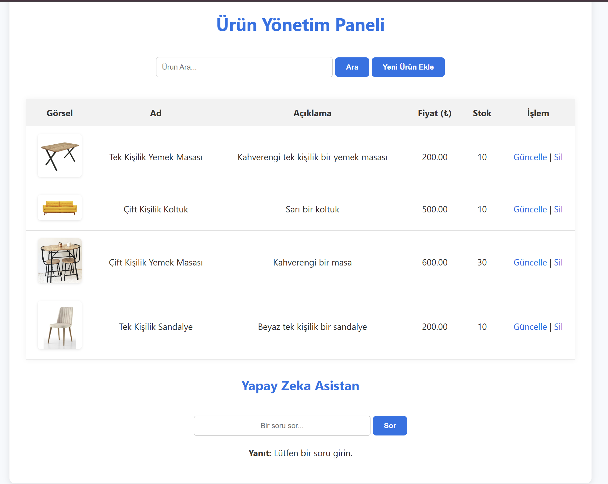
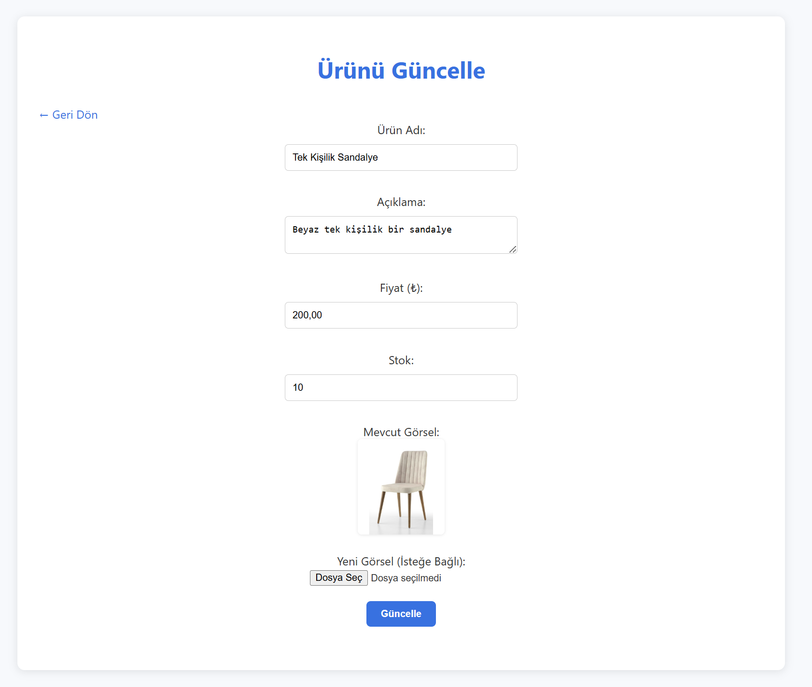
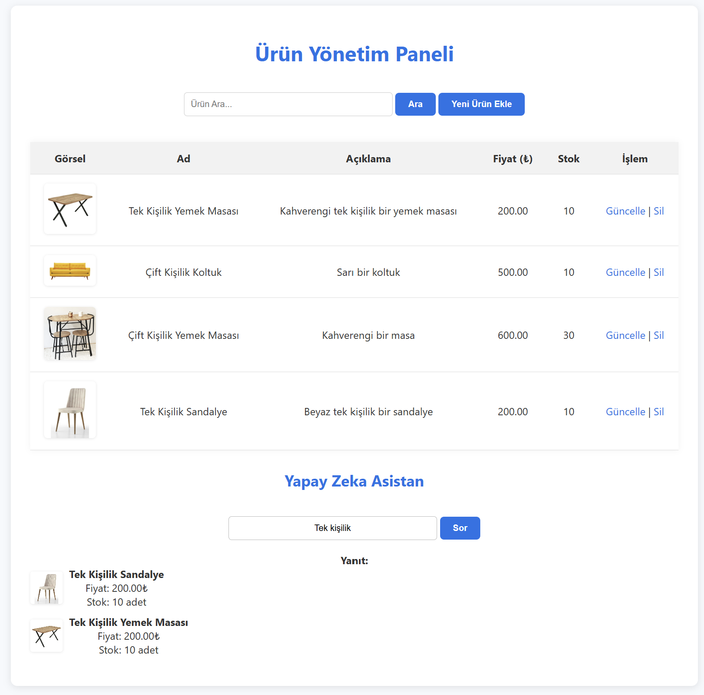

# 🛍️ E-Commerce Product Management Panel

This project is a simple e-commerce product management panel developed using PHP and MySQL. Users can **list products**, **search**, **add new products**, **update**, **delete**, and ask natural language questions about products through an **AI assistant**.

## 📸 Screenshots

| Product Panel | Update Product | AI Assistant |
|------------|---------------|---------------------|
|  |  |  |

## 🚀 Features

- ✅ Product listing (with visuals)
- 🔍 **Search** by product name, description, and price
- ➕ Add new products (including image upload)
- 🔄 Update existing products (optionally update product image)
- ❌ Delete products
- 🤖 Simple natural language **AI Assistant** (via OpenAI API)

## 🛠️ Technologies Used

- PHP (Core PHP, PDO)
- MySQL & phpMyAdmin
- HTML5 / CSS3
- OpenAI API (ChatGPT)
- Localhost (XAMPP)
